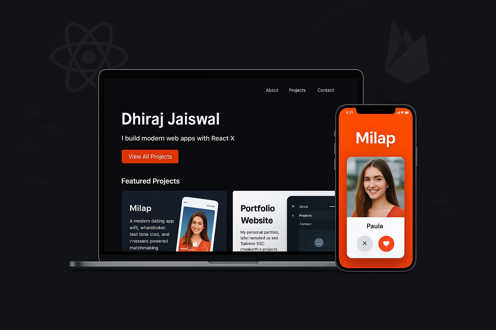

  

  
  
  

  
  
  
  

# 🌐 My Personal Portfolio  

✨ Welcome to the source code of my personal portfolio website – a showcase of my work, skills, and projects.  

Built with **Next.js**, styled with **TailwindCSS**, and deployed on **Vercel**, this portfolio highlights both my **frontend skills** and my **projects like Milap**.  

---

## 📌 Table of Contents  
- [✨ Features](#-features)  
- [🛠 Tech Stack](#-tech-stack)  
- [🚀 Deployment](#-deployment)  
- [📂 Project Structure](#-project-structure)  
- [📬 Contact](#-contact)  

---

## ✨ Features  

- 🎨 **Modern UI** – Clean and minimal design with TailwindCSS  
- 📱 **Responsive** – Works smoothly on mobile, tablet, and desktop  
- ⚡ **Fast Performance** – Powered by Next.js & optimized builds  
- 🖼 **Projects Showcase** – Highlights apps like **Milap** with screenshots & links  
- 📧 **Contact Section** – Easy way to reach me  

---

## 🛠 Tech Stack  

- ⚛️ **Framework** – [Next.js](https://nextjs.org/)  
- 🎨 **Styling** – [TailwindCSS](https://tailwindcss.com/)  
- ✨ **Animations** – [Framer Motion](https://www.framer.com/motion/)  
- 🚀 **Deployment** – [Vercel](https://vercel.com/)  

---

## 🚀 Deployment  

The portfolio is live here:  
👉 **[Visit My Portfolio](https://www.dhirajportfolio.online/)**  

Deployed using **Vercel** for seamless integration with GitHub.  

---

## 📂 Project Structure  

### 📦 Portfolio  
┣ 📂 **app**  
┃ ┣ 📜 **layout.js** # Root layout  
┃ ┣ 📜 **page.js** # Homepage  
┃ ┗ 📂 **components** # Reusable UI components  
┃ ┗ 📂 **about**  
┃ ┗ 📂 **contact**  
┃ ┗ 📂 **projects**  
┣ 📂 **public** # Static assets (images, icons, etc.)  
┣ 📜 package.json # Dependencies & scripts  
┣ 📜 tailwind.config.js  
┣ 📜 next.config.js  
┗ 📜 README.md  

---

## 📬 Contact  

- 📧 [jaiswaldhiraj928@gmail.com](mailto:jaiswaldhiraj928@gmail.com)  
- 💼 [LinkedIn](https://www.linkedin.com/in/jaiswaldhiraj/)  
- 🌐 [Portfolio Website](https://www.dhirajportfolio.online/)  

---
